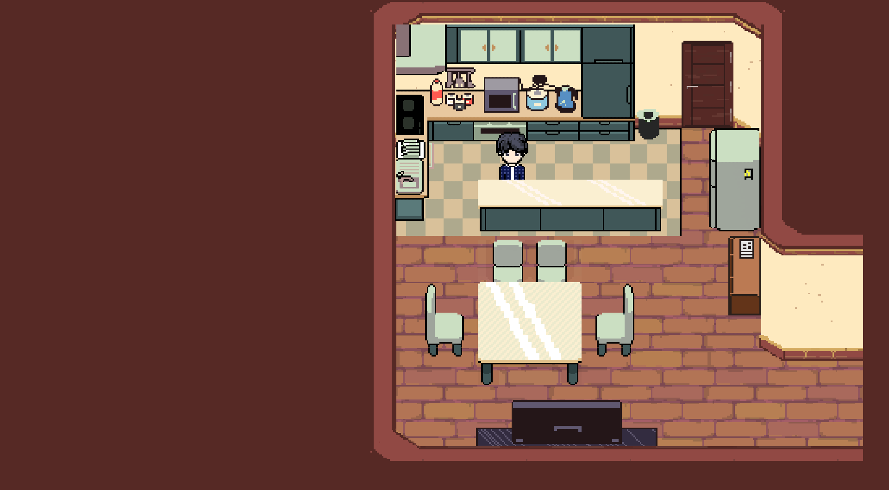

# Inner Anima

## About

**Inner Anima** is a psychological adventure where a boy becomes trapped in his own mind after a therapy session goes wrong. To escape, he must navigate surreal environments, solve puzzles, and confront his fears, uncovering hidden truths along the way.

## Preview

<div align="center">
 
 
 
</div>

<div align="center">
 
 
</div>

## Requirements

The minimum requirement by this application is that you have OpenGL 3.3 / OpenGL ES 3.0 compatible hardware.

## Development Setup

### Prerequisites

Before setting up the development environment, ensure you have the following installed:

| Tool                   | Version               | Download Link                                                      |
| ---------------------- | --------------------- | ------------------------------------------------------------------ |
| **Visual Studio Code** | Latest                | [Download](https://code.visualstudio.com/Download)                 |
| **.NET SDK**           | 8.0 LTS (Recommended) | [Download](https://dotnet.microsoft.com/en-us/download)            |
| **Godot Engine**       | v4.4.1 (.NET)         | [Download](https://godotengine.org/download/archive/4.4.1-stable/) |

### Initial Configuration

1. **Create Environment File**

   Create a `.env` file in the project root with your Godot installation path:

   ```bash
   GODOT_BIN=/path/to/godot
   ```

2. **Locate Godot Executable**

   Common installation paths:

   - **macOS**: `/Applications/Godot_mono.app/Contents/MacOS/Godot`
   - **Linux**: `/usr/local/bin/godot`
   - **Windows**: `C:\Program Files\Godot\Godot_v4.4.1-stable_win64.exe`

### Project Setup

1. **Configure Godot Editor**

   - Import the project in Godot
   - Navigate to **Editor** → **Editor Settings** (or **Godot** → **Editor Settings** on macOS)
   - Under **Dotnet** → **External Editor**, select **Visual Studio Code and VSCodium**

2. **Setup Development Environment**

   - Open any `.cs` file in Godot to launch VS Code
   - Install recommended extensions when prompted
   - Ensure your `.env` file is properly configured

3. **Initialize Project**
   - Open Command Palette: `Ctrl+Shift+P` (`Cmd+Shift+P` on macOS)
   - Run: **Tasks: Run Task** → **Setup Environment**

**NOTE:** You may need to give write permission to the script if setup fails

```bash
chmod +x scripts/setup.sh      # macOS/Linux
# scripts/setup.ps1            # Windows (run as administrator if needed)
```

## License

This project is proprietary software. See [LICENSE.md](LICENSE.md) for details.

## Contributing

This is a private development project. For inquiries, please contact the development team.
